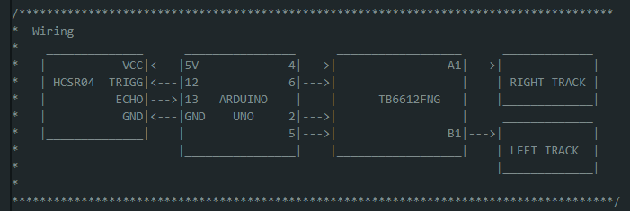
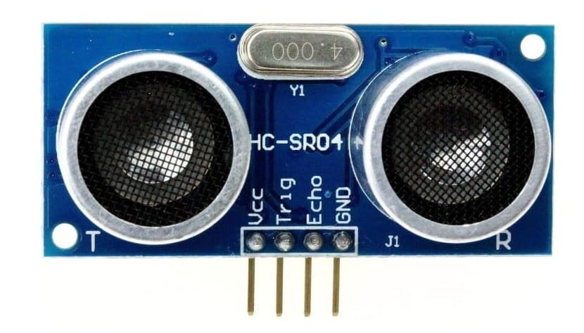
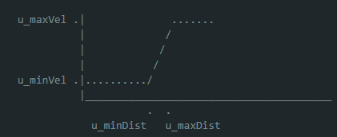

# Distance Keeper

Here I am using the wheels of the LA018_2WD_SmartRobotCar kit, wired to the L298N driver, and the HCSR04 ultrasonic car to create a distance keeper mobile robot.

The desired distance is coded to be 10 cm with an hysteresis value of 2 cm. This is applied to avoid the robot to be constantly toggling on a fixed point.

## Wiring

Using the code provided at this project, you would need to wire your components as in the simple diagram shown below. This diagram can be also found in the *distanceKeeper.ino* file.

## Distance measurement

In the **HCSR04** librarie, I measure distances by setting the *trigger* pin to HIGH for 10 $mu$s, then the time the signal takes to come bach is grabbed from the *echo* pin in the *u_timeFlight* variable. This distance in cm is calculated as below.

$$
    distance = \frac{timeFlight}{59} 
$$

## Speed control

The robot's speed is proportional to the error calculated as the difference between the HCSR04 measured distance and the desired distance (set to 10 cm as default). Then, this error is interpolated as in the image below.

The value returned by this interpolation is bounded from 0 to 255 which corresponds tho the PWM Duty Cycle provided to the motor wheels. Calling *minDist* and *maxDist* to the minimum and maximum error values, *minVel* and *maxVel* to the minimum and maximum allowed PWM Duty Cycles, and *input* to the measured error, the duty cycle given to the wheels is measured as

\[
    vel = \left\{ \begin{array}{lcl}
                    minVel & if & input < minDist\\
                    maxVel & if & input > minDist\\
                    \fr{maxVel - minVel}{maxDist - minDist} (input - minDist) + minVel & else\\
                \end{array} \right.
\]

## Libraries

The libraries needed to run this project are listed below. They must be placed at *./distanceKeeper/src*.

Need libraries:
- DDR
- HCSR04
- typeDefs
