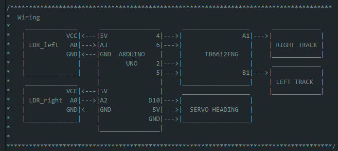

# Light follower

In this project, I am including a couple of LDR (Light Depending Resistor) modules to each side of the front part of the robot. LDR modules do not make part of the Mini Tank kit. These sensors are used to create a light following robot.

The servo attached at the bottom of the HCSR04 changes angle according to the light position to "follow the light". Note that in this project, the HCSR04 sensor is not enabled.

## LDR and speed control

Both LDR modules are connected to one of the analog inputs on the Arduino. In the Arduino UNO, read analog inputs return values from 0 to 1023 since they are 10-bit analog to digital converter channels.

In the case of the LDR, when full light strikes directly on the sensor a value of 0 is read, when in darkness 1023 is returned. For this reason, the speed of every track depends to the signal read from the sensor attached to it (left sensor to the left track and right sensor to the right track).

## Operational modes

Three operational modes are used on the robot functioning according to the light level signals and the error measured between them. 

If both light levels are below a certain threshold (indicating full light), OP_MODE_0 is activated which stops the robot.

If the light error is below a given value, OP_MODE_1 is enabled which makes the robot move forward searching for light (both wheels move at the same speed).

Finally, in any other case, OP_MODE_2 is set where each wheel spped is controlled by the light level on each sensor light.

  

## Wiring
Using the code provided in this project, you would need to wire your components as in the simple diagram shown below. This diagram can be also found in the [lightFollower.ino](./lightFollower/lightFollower.ino) file.

## Libraries

The libraries needed to run this project are listed below. They must be placed at [./lightFollower/src](./lightFollower/src).

Need libraries:
- typeDefs
- commonAlgo
- tankTrack
- myServo
