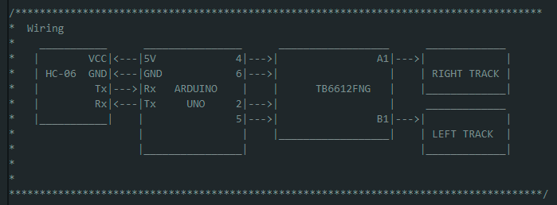

# BT Controlled DDR

In this simple project, I use a BT receiver (which is not present in the LA018_2WD_SmartRobotCar kit) used along with the Bluetooino app (available in the Play store for Android) to command the robot motion at a constant speed according to the controls in the image.

## Remote App decoder

Before stteping into the project on the [BT_controlled_ddr](./BT_controlled_ddr/) folder, we need to know how to interpret the received information from the Bluetooino app. This can be achieved by first loading the project [BT_decoder](./BT_decoder/) and trying the keys in the app. The key value attached to it will be shown on the LCD screen via I2C.

Wire the components according to the next diagram.

In my case, I am using the arrow and OK keys on my remote which decode according to the image below.

These values are then used on the [BT_controlled_ddr](./BT_controlled_ddr/) folder in an intuitive manner to make the robot move.

## Wiring

Using the code provided at this project, you would need to wire your components as in the simple diagram shown below. This diagram can be also found in the [BT_controlled_ddr.ino](./BT_controlled_ddr/BT_controlled_ddr.ino) file.

## Libraries

The libraries needed to run this project are listed below. They must be placed at [BT_controlled_ddr.ino](./BT_controlled_ddr/BT_controlled_ddr.ino).

Need libraries:
- typeDefs
- DDR
- BT_encodedData
