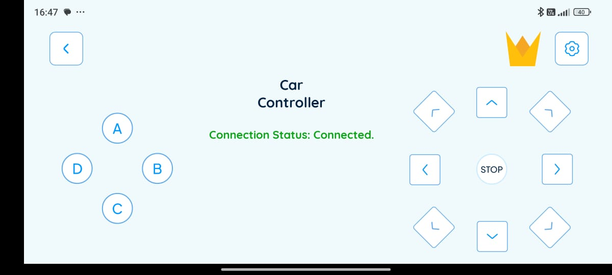
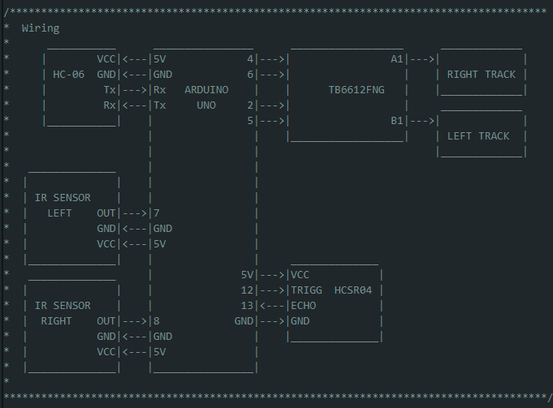

# Obstacle Avoiding Tank

## Bluetooth and Obstacle Avoiding - Dual Mode
Using the code from the  projects [BT Controlled Tank](../4_btControlledTank/) and [Distance Keeper](../1_distanceKeeper/), we can toggle between controlling the robot ourselves using the bluetooth approach, move the tank forward untill it reaches a wall or letting the robot wander by it self avoiding obstacle collisions. 

To get to the BT controlloed mode, press the B button. To get to the Distance Keeper mode, press D. For an self driving mode, press A. By pressing either C, the robot stops.

## IR Sensors for side correction

Since the HCSR04 sensor is not capable to "see" the obstacles to the sides of the robot, I am including IR sensors to each side to correct the robot speed when an obstacle is detected. This is useful for wall following.

## Wiring
Using the code provided at this project, you would need to wire your components as in the simple diagram shown below. This diagram can be also found in the [obstacleAvoidingTank.ino](./obstacle_avoidobstacleAvoidingTanking_car/obstacleAvoidingTank.ino) file.

