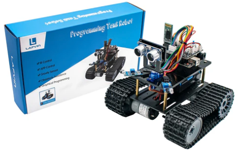

# Mini-Tank-Robot

In this project I experiment over the [LAFVIN Mini Tank Robot kit](https://lafvintech.com/products/new-lafvin-mini-tank-robot-smart-robot-car-kit-for-arduino-robot-education-programming-kit-with-tutorial) from LAFVIN. It is worth mentioning that none of the codes in the LAFVIN tutorials is being used. However, the tutorial and code can be found in this [link](https://battery-box-version-description-la033.readthedocs.io/es/latest/).

The project is separated over a total of 5 implementations listed below.

## [Distance Keeper](./1_distanceKeeper/)

## [IR Controlled Tank](./2_IRcommanded/)

## [Light Controlled Tank](./3_lightFollower/)

## [Bluetooth Controlled Tank](./4_btControlledTank/)

## [Obstacle Avoiding Tank](./5_obstacleAvoidingTank/)

Most of the code is based on the project [LA018_2WD_SmartRobotCar](https://github.com/MarcoEsquivelBasaldua/LA018_2WD_SmartRobotCar) which I developped earlier and I used as basis.
